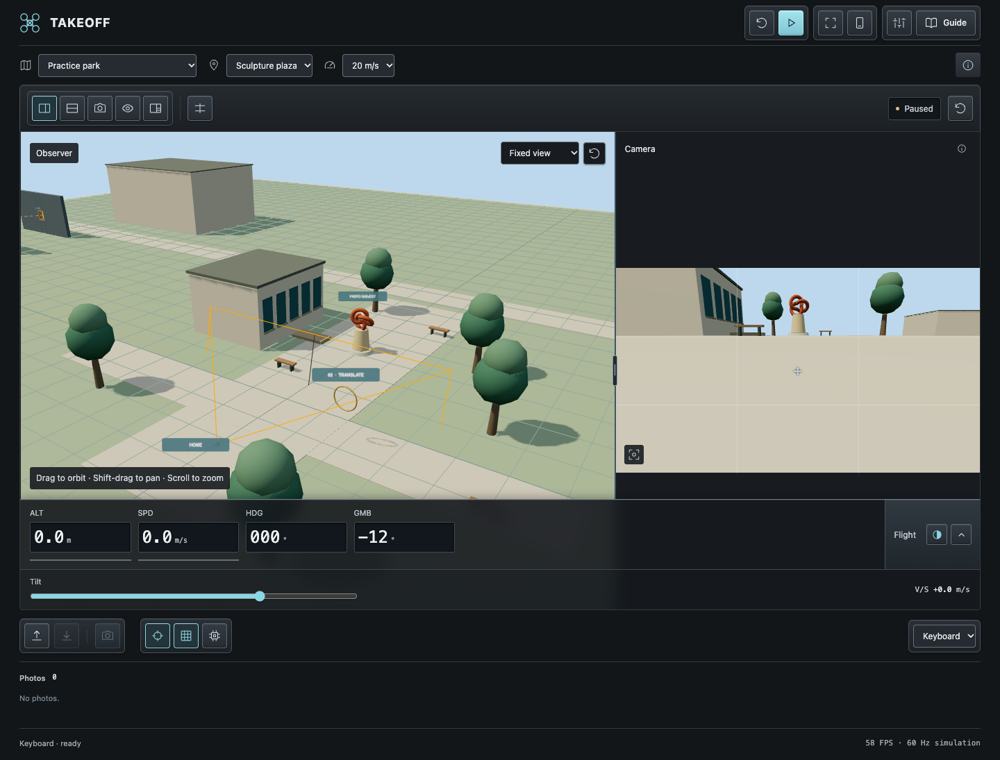
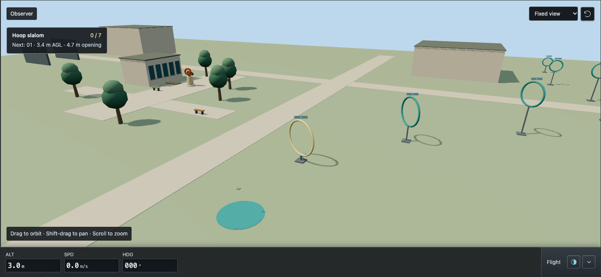
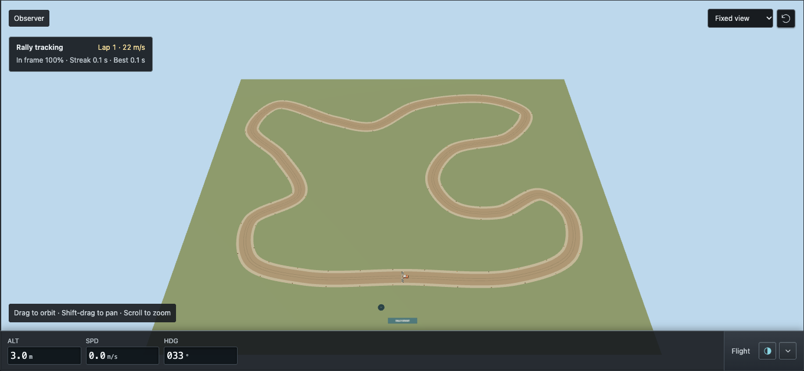
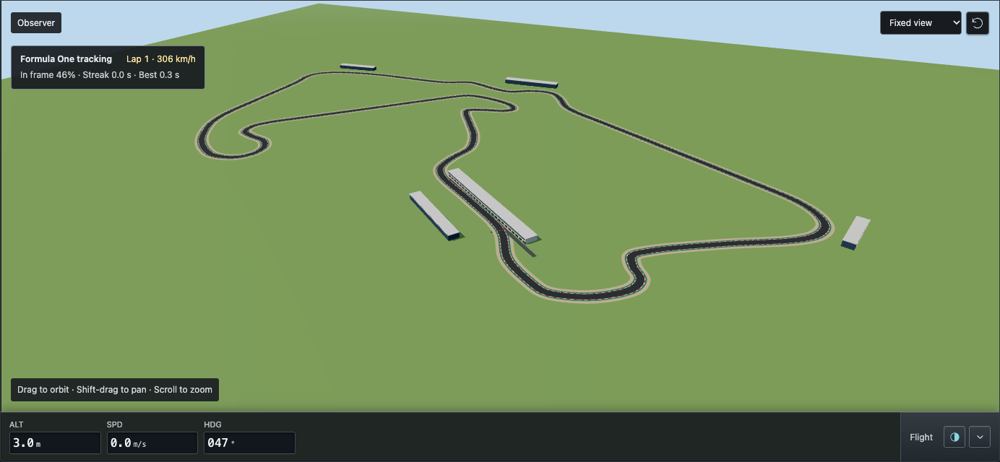
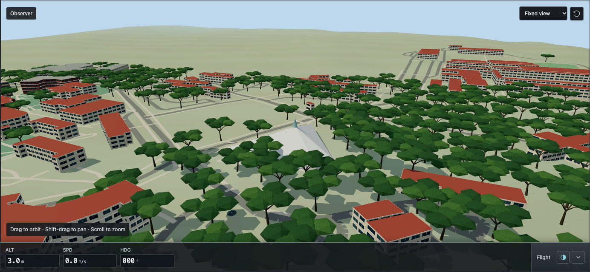
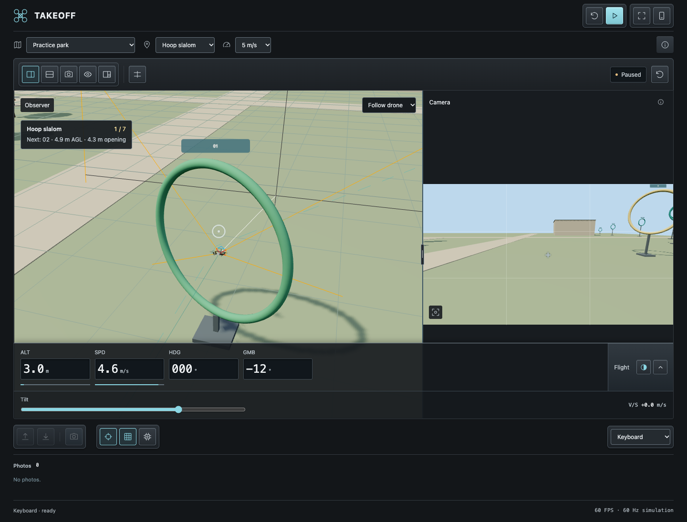

# Takeoff

**Fly the route. Find the shot.**

Takeoff is a browser-based drone simulator that turns your laptop into a flight playground and camera practice station. Made to assist photographers of the Ateneo Resident Students Association (ARSA) in learning how to fly drones for documentation work. Thread a hoop slalom, follow a rally car through a hairpin, or find a new angle on Ateneo's campus. Fly with your keyboard or turn your phone into a two-stick controller, then bring home the shot as a PNG.

[Play Takeoff](https://takeoff-0qrz.onrender.com/) · [Start flying locally](#get-started) · [Explore the maps](#choose-your-next-flight) · [Pair a phone](#pair-an-android-phone) · [Host your own](docs/HOSTING.md)



## Choose how to fly

Takeoff opens to a menu with two modes. **Game → Flight Rush** is an endless scored course with a third-person follow view and a live drone-camera inset. **Practice tool** opens the existing flight station, maps, photo gallery, and adjustable views. Select the Takeoff logo to return to the menu.

In Flight Rush, take off to begin. The course scrolls automatically while you fly with the same keyboard or phone controls as Practice. Hold forward to go faster; the course follows continued travel at the front of the view. Pull backward to slow down safely. The PACE reading includes your forward/backward movement. Each cycle asks for forward and backward movement, left and right strafing, climb and descent, yaw in both directions, a hover, camera tilt in both directions, and a beacon capture. Complete the requested maneuver and pass through the opening to earn points. The camera gates check tilt and the capture gate lights up when its beacon is in frame.

Earn **2 points per meter**, **100 per gate**, and **50 extra for a centered pass**. Every four consecutive gates raises the multiplier, up to **×5**. You have **three shields**; a missed opening or incomplete maneuver costs one shield and breaks the streak. Ground contact or crossing the corridor’s sides or ceiling ends the run. Every eight gates increases course speed and tightens the openings. Best scores are saved in this browser. **Space** pauses/resumes, **L** (or the phone’s Land button) banks the score and ends the run, and **Restart run** resets the course. Flight Rush uses fixed trainer handling so scores do not depend on your Practice aircraft settings.

## Choose your next flight

| Map                           | What you'll do                                                                                                                                                                  |
| ----------------------------- | ------------------------------------------------------------------------------------------------------------------------------------------------------------------------------- |
| **Practice park**             | Explore the sculpture plaza, then tackle **Hoop slalom**, **Window gaps**, or **Tight corridor**. Clear numbered gates through turns, altitude changes, and shrinking openings. |
| **Rally circuit**             | Follow a moving rally car around a gravel circuit. Keep it in frame through the hairpins and try to beat your best tracking streak.                                             |
| **Silverstone · Formula One** | Track an F1 car around an approximate **5.891 km** Grand Prix layout. Take the **Tracking helicopter** for flights at up to **90 m/s**.                                         |
| **Ateneo · Loyola Heights**   | Launch near **ten campus landmarks**, explore modeled terrain and acacia-lined roads, and compose architectural shots around Gesù, Areté, Rizal Library, and more.              |

<table>
  <tr>
    <td width="50%"><br><strong>Practice park · Hoop slalom</strong></td>
    <td width="50%"><br><strong>Rally circuit</strong></td>
  </tr>
  <tr>
    <td width="50%"><br><strong>Silverstone · Formula One</strong></td>
    <td width="50%"><br><strong>Ateneo · Loyola Heights</strong></td>
  </tr>
</table>

## Your flight station

- **See the flight and the frame.** Watch the drone from an adjustable observer view alongside its stabilized camera. Resize the split, stack the views, or go camera-only and fullscreen for a closer look at your composition.
- **Put the sticks in your hands.** Pair a phone for two-stick control with DJI Modes **1, 2, and 3**, or use the keyboard. Centered sticks brake into a hover; takeoff and landing are automatic.
- **Make the shot.** Adjust gimbal tilt, line up the thirds grid, and capture **1280 × 720 PNGs** without interface overlays. Download your favorites from the photo gallery.
- **Tune your aircraft.** Adjust speed, acceleration, braking, and camera response. Start from the DJI Mini 4 Pro, Air 3, Mavic 3 Classic, or Tracking helicopter presets; applied settings are saved locally.
- **Set up your workspace.** Keep live flight instruments at the bottom, choose glass or solid readouts, and save your layout preferences. The in-app **Guide** covers controls, pairing, and layouts, including in fullscreen.

No account or phone app required. Run locally and fly offline once the app is installed and built, including the bundled campus map. Local phone control supports Android USB or Wi-Fi; a hosted deployment supports wireless pairing over Wi-Fi or mobile data.

Takeoff is a working prototype with an assisted-flight model, approximate aircraft presets, and simplified scenery. See [Current scope](#current-scope) for simulation limits.

[Open a hosted version](#open-a-hosted-version) · [Controls](#controls) · [Map details](#practice-maps) · [Troubleshooting](#troubleshooting) · [Development](#development)

## Open a hosted version

Open [Takeoff on Render](https://takeoff-0qrz.onrender.com/) on your laptop. No local installation is needed:

1. Use a current WebGL 2 browser. Choose **Game** or **Practice tool** from the menu. Keyboard flight is available in both.
2. To use a phone, select **Pair phone** and scan the QR code with the phone camera, or use **Copy phone link** to open the full link on the phone.
3. Rotate the phone to landscape, center both sticks, and select **Enable controls**.
4. Close the pairing dialog on the laptop, then select **Take off** on either device.

Both devices need internet access. They can use the same Wi-Fi, different networks, or mobile data. Each laptop page has its own private pairing link; keep the link with the person controlling that flight. Reloading the laptop page or restarting the server requires a new link. Multiple stations can practice independently, up to the prototype's 32-session limit; performance at that capacity has not been measured.

**Phone USB on a hosted app:** plugging in an Android phone does not give a website access to the existing ADB connection. Direct cable-only control uses the [local USB setup](#usb-use-the-cable-instead-of-wi-fi). OS-supported USB tethering can provide internet for the hosted version, but controls still use the hosted relay; this is not a direct USB control transport. The hosted UI offers wireless pairing only.

[Hosting instructions](docs/HOSTING.md) include a free Render deployment configuration for running your own instance.

## Get started

These steps are for running Takeoff on your own laptop. Learners using a hosted link can skip them.

### What you need

- A Mac with Node.js **22.12 or newer** and npm.
- A laptop browser with WebGL support. Google Chrome is used by the automated browser tests.
- Optionally, an Android phone with a browser. USB control also needs a data-capable cable, USB debugging, and Android SDK Platform-Tools on the Mac.

The current setup has been exercised on Mac and Android. Other desktop and phone combinations have not been verified.

### Start the simulator

In this project directory, run:

```sh
npm ci
npm run build
npm start
```

Open [http://127.0.0.1:8080](http://127.0.0.1:8080) on the laptop and choose **Game** or **Practice tool**. Leave the terminal running while you fly; press **Ctrl+C** there when you are finished. Future sessions only need `npm start`, unless the app has changed and needs rebuilding.

If port 8080 is already in use, choose another port:

```sh
PORT=8082 npm start
```

Then open [http://127.0.0.1:8082](http://127.0.0.1:8082). Use that same port for phone connection checks and manual USB commands below. **Connect USB phone** automatically uses the running server's port.

### Your first flight with the keyboard

1. Choose **Practice tool** from the menu and leave **Controls** set to **Keyboard**.
2. Select **Take off**, or press **T**. The drone climbs automatically to 3 m.
3. Hold **W** briefly to climb toward 4 m, then release it. Watch the drone brake into a hover.
4. Use the **arrow keys** to move and **A / D** to turn. Compare the observer and camera views.
5. Use **R / F** or the **Camera tilt** slider to frame the orange sculpture. Select **Capture photo**, then select its thumbnail under **Photos** to download it.
6. Return over the home pad and press **L** to land. **Land descends at the current location**; it does not return to the pad automatically.

Takeoff starts the simulation automatically from the ground. Press **Space** to pause or resume. After a collision, select **Reset**, then **Take off** to try again.

## Pair an Android phone

The laptop renders the simulator; the phone sends controls and displays flight status. Keep both browser pages open. Only one phone can control a laptop session at a time. Pairing follows the laptop browser tab when you switch between Game, the menu, and Practice tool. After switching, center the sticks and select **Enable controls** on the same phone, then take off; you do not need to scan again.

For a hosted deployment, use the [wireless QR pairing steps above](#open-a-hosted-version). The following USB and LAN instructions apply to a local server.

### USB: use the cable instead of Wi-Fi

USB pairing bypasses the Wi-Fi network. The local server still runs on the Mac, and ADB forwards the phone's browser connection through the cable. On the phone, `127.0.0.1` reaches the Mac only after USB forwarding is set up.

1. Install [Android SDK Platform-Tools](https://developer.android.com/tools/releases/platform-tools) on the Mac, or use the copy installed by Android Studio.
2. Enable **Developer options → USB debugging** on the phone. See [Android's USB connection instructions](https://developer.android.com/tools/adb#Enabling) if you need help finding the setting.
3. Connect the phone with a data-capable USB cable. Unlock it and accept **Allow USB debugging?** if prompted.
4. On the laptop, select **Pair phone**, choose **USB cable · no Wi-Fi**, and select **Connect USB phone**.
5. Wait for **USB connection ready**. Scan the QR code with the phone's camera or open the complete **Open on phone** URL in its browser, including the part after `#`.
6. Rotate the phone to landscape. Leave both sticks centered and select **Enable controls**.
7. Close the laptop pairing dialog. Pairing automatically selects **Phone** as the control source.
8. Select **Take off** on either device to begin flying.

The app finds ADB through `PATH`, the usual macOS Android SDK location, `ANDROID_HOME`, `ANDROID_SDK_ROOT`, or `ADB_PATH`. If it cannot find a separately downloaded copy, start the server with its absolute path, for example:

```sh
ADB_PATH="$HOME/Downloads/platform-tools/adb" npm start
```

Run **Connect USB phone** again after reconnecting the cable or restarting ADB if the phone can no longer reach the simulator.

<details>
<summary>Manual USB setup and removal</summary>

If `adb` is available in your terminal, you can set up forwarding yourself:

```sh
adb devices
adb -d reverse tcp:8080 tcp:8080
adb -d reverse --list
```

For a server running on port 8082, replace both occurrences of `8080` with `8082`. The forwarding list should contain the matching pair, such as `tcp:8082 tcp:8082`. `-d` selects a USB device; leave only the intended USB phone connected.

Remove this forwarding when finished:

```sh
adb -d reverse --remove tcp:8080
```

If the terminal reports `adb: command not found`, use the executable's full path or the app's **Connect USB phone** button.

</details>

### Local Wi-Fi

1. Connect the laptop and phone to the same local network.
2. Stop the existing server with **Ctrl+C**, then start it with network access enabled:

   ```sh
   npm run start:lan
   ```

   To use port 8082 instead: `PORT=8082 npm run start:lan`.

3. Open the simulator on the laptop, select **Pair phone**, and choose a **Wi-Fi** address from the **Connection** menu. If several addresses appear, choose the interface connected to the phone's network.
4. Scan the QR code or open the displayed URL on the phone. Rotate to landscape and select **Enable controls**.
5. Close the pairing dialog and select **Take off** on either device. No separate laptop start is needed for a grounded flight.

Allow the local Node server through the Mac firewall if prompted. Guest or classroom networks can block connections between devices; use USB if the phone cannot reach the laptop.

### Pausing, resuming, and changing phones

**Pause controls** on the phone disables its input and pauses the flight. The phone shows a **Game paused** prompt during an interrupted flight. To continue, center the sticks and select **Enable controls**, then **Resume game** on the phone. If the drone is grounded, select **Take off** on either device. **Start practice** on the laptop also resumes flight. Use this same sequence after a cable disconnect, connection loss, or either page being hidden. Return to the laptop page and close any open dialogs before resuming; a collision requires **Reset flight** on the laptop.

Brief network delays temporarily center the sticks instead of disabling controls. Input older than 250 ms is ignored; a 2-second input gap or 3-second lapse in laptop status pauses the flight. Previously enabled controls reconnect automatically with centered sticks when communication returns. Tap **Resume game** to continue a paused flight. **Pause controls** cancels automatic recovery; explicit pauses, hidden pages, and disconnected sockets still require **Enable controls**.

Keep the phone awake. The controller requests a screen wake lock where supported; if it says **Set screen timeout manually**, adjust the phone's timeout. Plain HTTP over Wi-Fi cannot use this feature. **Fullscreen** on the phone hides browser controls where supported, and **Stick size** adjusts the touch areas.

To replace the controlling phone, open **Pair phone** and select **Revoke phone & renew link**, then pair with the new QR code. A second phone cannot take over an occupied session. Reloading the laptop page retains pairing in the same tab and pauses controls. Links expire after 12 hours; after restarting the server or closing the laptop tab, use the current pairing link.

To return to keyboard practice, choose **Keyboard** in the laptop's **Controls** menu. Select **Take off** from the ground, or **Start practice** to resume an airborne flight.

## Controls

The phone's **Stick mode** menu follows the layouts in [DJI's remote controller guide](https://developer.dji.com/mobile-sdk/documentation/introduction/component-guide-remotecontroller.html). **Mode 2** is the default. The selected mode is saved in the phone browser. Changing it centers both sticks and pauses controls; select **Enable controls**, then take off from the ground or tap **Resume game** on the phone.

| Stick mode       | Left stick up / down | Left stick left / right | Right stick up / down | Right stick left / right |
| ---------------- | -------------------- | ----------------------- | --------------------- | ------------------------ |
| Mode 1           | Pitch                | Yaw                     | Throttle              | Roll                     |
| Mode 2 · Default | Throttle             | Yaw                     | Pitch                 | Roll                     |
| Mode 3           | Pitch                | Roll                    | Throttle              | Yaw                      |

Throttle commands climb / descent, yaw turns the drone, pitch commands forward / backward movement, and roll commands sideways movement in this assisted-flight simulator. DJI's Mobile SDK mobile remote controller itself supports only Mode 2; Modes 1 and 3 here are simulator practice layouts.

The action table below uses Mode 2.

| Action                     | Phone                                              | Keyboard                     |
| -------------------------- | -------------------------------------------------- | ---------------------------- |
| Climb / descend            | Left stick up / down                               | W / S                        |
| Turn left / right          | Left stick left / right                            | A / D                        |
| Move forward / backward    | Right stick up / down                              | ↑ / ↓                        |
| Move sideways left / right | Right stick left / right                           | ← / →                        |
| Tilt camera up / down      | Hold the Tilt buttons                              | R / F, or Camera tilt slider |
| Take off / land            | Take off / Land buttons                            | T / L                        |
| Take a photo               | Camera shutter button                              | C                            |
| Pause / resume             | Pause controls / Enable controls, then Resume game | Space                        |

Movement follows the drone's heading. When the drone faces you, its rightward movement appears leftward in the fixed observer view. Releasing the sticks or movement keys commands a stop, with a short braking response into hover.

**Speed limit** offers 5 m/s, 10 m/s, and the configured drone's maximum, omitting caps above that maximum. The helicopter also offers **20, 50, and 85 m/s**; 85 m/s matches the F1 car's maximum speed. This temporary cap does not change your saved settings. Maximum horizontal speed includes diagonal movement. The default trainer flies at up to 20 m/s, accelerates at 5 m/s², and brakes at 8 m/s², taking about four seconds to accelerate and 25 m to stop from full speed with centered sticks. Its manual climb and descent limits are 5 m/s; automatic takeoff and landing are slower.

The sliders icon beside **Guide** opens **Drone parameters**. Choose the trainer, a commercial preset, **Tracking helicopter**, or **Custom**, then adjust horizontal speed, independent climb and descent speeds, turn speed, acceleration, braking, camera tilt speed, and vertical field of view. **Apply settings** updates the simulation and saves the configuration in this browser. **Cancel** discards the draft, and **Restore trainer defaults** fills the draft with the original quadcopter profile. Opening setup or the guide pauses flight; close the dialog and explicitly resume when ready. Changing aircraft type resets the flight and tracking session at the launch pad; photos remain in the gallery.

**Tracking helicopter** is a virtual assisted-flight aircraft for F1 tracking, with a helicopter body, cockpit, landing skids, main rotor, tail rotor and underslung camera. It reaches **90 m/s (324 km/h)** with **20 m/s²** acceleration and **25 m/s²** braking, climbs at **15 m/s**, and descends at **10 m/s**. Handling is tuned for the simulator. The larger aircraft uses its own ground clearance and collision envelope, so leave room for its rotor and tail near buildings. Editing its parameters creates **Custom helicopter** and preserves the helicopter model after saving or reloading.

Commercial presets use the manufacturers' published maximum horizontal, ascent, and descent speeds: [DJI Mini 4 Pro](https://www.dji.com/mini-4-pro/specs), [DJI Air 3](https://www.dji.com/air-3/specs), and [DJI Mavic 3 Classic](https://www.dji.com/mavic-3-classic/specs). Turn rate, acceleration, and braking are simulator estimates. Camera settings and aircraft size retain the trainer defaults; these presets approximate assisted flight rather than reproducing a complete aircraft. Preset maximum speeds do not incorporate regional firmware limits.

The drone body banks during movement while the camera horizon stays level. Turning the drone changes camera heading; gimbal tilt changes its vertical angle independently. Takeoff and landing are automatic maneuvers; movement input resumes after takeoff finishes.

Keyboard flight requires focus on the simulator, away from menus and sliders. The laptop's camera-tilt slider is disabled while **Phone** is selected.

### Views and flight information

| Setting       | Use it to                                                                                                                                                                                      |
| ------------- | ---------------------------------------------------------------------------------------------------------------------------------------------------------------------------------------------- |
| Fixed view    | Drag to orbit, Shift-drag or right-drag to pan, and scroll to zoom. The viewpoint stays where you leave it. On touch screens, use one finger to orbit and two fingers to pan or pinch to zoom. |
| Follow drone  | Keep the observer camera near the drone as it moves.                                                                                                                                           |
| Map overview  | See the whole selected map from above, with north toward the top.                                                                                                                              |
| Observer aids | Show the ground grid, labels, flight trail, camera direction, and field-of-view outline.                                                                                                       |
| Thirds grid   | Place subjects using a rule-of-thirds guide in the camera view.                                                                                                                                |
| Campus trees  | Show or hide the Ateneo acacias and their collisions. The setting is saved between visits.                                                                                                     |
| Side by side  | Show both views with an adjustable divider. Drag the divider, or focus it and use arrow keys, to change the proportions. On narrow screens the views stack.                                    |
| Stacked       | Arrange the observer above the camera with an adjustable horizontal divider.                                                                                                                   |
| Camera only   | Practice from the drone camera with flight instruments fixed at the bottom.                                                                                                                    |
| Observer only | Use the full workspace for the observer, with flight instruments and capture controls still available.                                                                                         |
| Classic       | Use the original observer and camera sidebar arrangement, with flight instruments docked below the camera.                                                                                     |
| Fullscreen    | Fill the window with flight views, compact instruments, and flight controls; restore the desktop workspace when you exit.                                                                      |
| Low graphics  | Disable shadows and reduce rendering resolution on slower hardware.                                                                                                                            |

Select **Exit fullscreen** or press **Escape** to return to the normal layout. If native fullscreen is unavailable, the simulator expands within the browser panel instead.

Fullscreen hides the title, location and layout bars, display settings, control-source selector, photos, and performance footer. When both views are active, the observer fills the screen and the 16:9 camera becomes an inset in the upper right. Camera-only and observer-only layouts keep their selected view. The floating console retains reset, play/pause, takeoff, landing, capture, flight status, exit, **Guide**, and drone parameters. Instruments start compact and can be expanded; exiting restores the desktop layout and instrument state. [Fullscreen preview](docs/images/fullscreen.png).

Desktop controls use icons in separate modules with raised buttons and recessed readouts. Hover or focus a control for its name and keyboard shortcut; display toggles are highlighted when active. The play/pause button starts or pauses practice. Flight status appears once in the layout bar, or in the floating fullscreen console; hover or focus it for the pause reason. A collision shows a persistent **Reset flight** prompt that returns the drone to the launch point. Location hints and camera specifications are available from the information icons.

**Guide** is the labeled exception to the icon toolbar. Its Startup, Controls, Connection, and Layout tabs explain the station and include an **Open pairing** shortcut. The guide and parameter dialogs stay accessible on narrow screens and in fullscreen. Escape closes a dialog first, preserving expanded fullscreen.

The fixed observer also supports keyboard adjustment: focus the observer and use **Alt + arrows** to pan, **Alt + Shift + arrows** to orbit, and **Alt + plus/minus** to zoom. Unmodified arrow keys still fly the drone. **Reset fixed view** beside the camera menu restores the launch viewpoint. Switching to Follow or Overview and back preserves your adjustments; changing the map or launch location resets the viewpoint for that location.

The layout icons select the viewing arrangement. **Equalize views** gives both views equal space; **Reset workspace** restores the default side-by-side layout and instrument settings. The drone camera keeps a 16:9 frame as the views resize, matching exported photos.

The **Flight** instrument panel is fixed to the bottom of the workspace; desktop Classic keeps it beneath the camera. In fullscreen, flight controls sit above the data strip. The half-filled circle switches between a translucent glass display and an opaque panel; the chevron collapses or expands the instruments. A collapsed panel keeps live altitude, speed, and heading visible, while hiding gimbal and vertical-speed details. Layout, divider proportions, transparency, and collapse state are saved in this browser. Instruments remain anchored when the window resizes or fullscreen changes.

**Altitude · AGL** is height above the drone's resting position on the ground directly below it, **Ground speed** is horizontal speed, **Heading** is the drone's direction in degrees, and **Gimbal tilt** is the camera's vertical angle, from −90° to +20°. **V/S** shows vertical speed, positive while climbing. The altitude and speed scales show their values relative to the map ceiling and selected speed limit. Flying horizontally maintains world altitude, so clearance decreases over rising terrain. Takeoff climbs 3 m above the launch point; landing follows the local terrain.

### Practice maps

Use **Map** above the views to choose **Practice park**, **Rally circuit · Tracking**, **Silverstone · Formula One**, or **Ateneo de Manila · Loyola Heights**. All maps have a **300 m** simulator ceiling. The park has a **240 × 240 m** flight area and the rally stage has a **340 × 280 m** flight area. Silverstone has an approximate full-size **5.891 km** GP lap with **1 km of open approach space beyond the circuit on every side**. The campus follows its mapped boundary, approximately **930 × 1,590 m**.

In the park, the route menu offers **Sculpture plaza** for free flight and three obstacle courses:

| Route          | Challenge                                                                                                                    |
| -------------- | ---------------------------------------------------------------------------------------------------------------------------- |
| Hoop slalom    | Seven hoops with turns and altitude changes, rising to 9 m and descending again. Clear diameters shrink from 4.7 m to 2.3 m. |
| Window gaps    | Five walls with offset openings at different heights. The last window measures 1.6 × 1.6 m.                                  |
| Tight corridor | A covered passage with two right-angle turns, a low beam, and a 1.6 × 1.6 m exit.                                            |

Choose a route to start at its entrance, then select **Take off**. Start with the **5 m/s** speed limit; brake before turns and small openings. Fly through the numbered gates in order and in the direction of the route. The next gate is pale gold, cleared gates turn green, and the flight view shows the count and the next gate's altitude and opening width. Observer aids add a dashed route through the gate centers. Hoops, wall edges, roofs, and beams are solid obstacles and remain visible with aids off. **Reset flight** returns to the selected entrance and clears route progress. You can explore all three courses from free flight; selecting one enables its progress tracking.



Choose **Rally circuit · Tracking** to practice keeping a moving subject in frame. An orange rally car follows a closed gravel circuit at **10–22 m/s (36–79 km/h)**, slowing for hairpins and accelerating along the straights. The car starts when the drone finishes taking off. Climb to **10–20 m** for a wider view, then use movement, yaw, and camera tilt to frame it; a **20 m/s** flight limit helps when following it. The tracking panel shows the current lap and car speed, the percentage of airborne practice time the car is in frame, and the current and best uninterrupted framing streaks. Framing uses the visible car as its subject and checks for occlusion. The car is a collision obstacle. Pausing freezes its position and statistics; landing stops it, and **Reset flight** resets the car, drone, and tracking statistics. Camera-only, fullscreen, phone controls, and photo capture also work in this stage.

Choose **Silverstone · Formula One** for a red open-wheel car with slick tires, front and rear wings, a cockpit and halo. The asphalt circuit includes red and white curbs, runoff, the pit lane, an illustrative Silverstone Wing, grandstands, and labels covering the 18 GP corners. The centreline is approximated from [Silverstone's published circuit map](https://www.silverstone.co.uk/sites/default/files/pdf/British%20Grand%20Prix%202025%20Map.pdf) and uniformly scaled to the [FIA's 5.891 km circuit length](https://www.fia.com/system/files/decision-document/2025_silverstone_event_-_circuit_map_-_silverstone_2025.pdf); corner radii, scenery, and the **30–85 m/s (108–306 km/h)** speed profile are illustrative. Launch beside Hamilton Straight. Use **Map overview** to learn the route, then climb for a wide view and anticipate each pass. Select **Tracking helicopter** to keep pace with the car and use the surrounding open area for approaches and wide turns. Tracking feedback, pausing, reset, phone controls and photo capture work as in the rally stage. The car and modeled structures are collision obstacles.

On the campus, **Photo spot** provides launch pads near the **Church of the Gesù, Areté, Rizal Library, Blue Eagle Gym, Manila Observatory, Science Education Complex, Horacio de la Costa Hall, Ricardo & Rosita Leong Hall, JG School of Management, and International Residence Halls**. Launch placement checks for an open view of the selected building from a 3 m hover. Pads and the amber exercise markers are simulator additions. Switching maps or spots pauses and resets the flight; existing photos remain in the gallery. Phone control must be enabled again after a location change. Reset returns to the selected spot.

The campus uses mapped building footprints, paths, roads, and fields in a WGS84 local meter projection. **One scene unit is one meter**, horizontally and vertically, with no terrain exaggeration. The aircraft's unfolded body measures **0.326 × 0.2588 × 0.1058 m**, using [DJI Air 3's published dimensions](https://www.dji.com/air-3/specs) as a size reference. Propeller size is estimated; the generic flight model is separate from this visual reference. Collision checks use the aircraft's physical envelope and subdivide fast movement to detect thin obstacles.

Campus terrain comes from **30 m SRTM elevation data**, resampled to a 30 m metric grid and lightly smoothed to reduce radar and canopy noise. Roads, fields, launch-pad markings, and ground contact follow the same triangle surface. These historical radar elevations represent broad slopes and can include vegetation and structures; they do not resolve curbs, stairs, individual building platforms, or current survey elevations. The simulator's boundary and ceiling describe its practice area.

Landmark modeling uses published descriptions and photographs: Gesù has its tetrahedral roof, glazed cupola, cross, and entrance columns; Areté has four floors and facade fins; Rizal Library has five floors, brick accents, and window bands; Blue Eagle Gym has a curved roof. References include the architects' pages for [Church of the Gesù](https://www.rchitects.ph/projects/project/church-of-the-gesu/) and [Rizal Library](https://www.rchitects.ph/projects/project/ateneo-rizal-library/), Ateneo's [Areté building description](https://sites.google.com/ateneo.edu/sustainabledevelopmentgoals/initiatives/arete), and [Rizal Library venue information](https://sites.google.com/ateneo.edu/9rlic/venue). Building heights and facade proportions remain estimates; generic buildings use mapped heights or levels when available. This is a practice model, and its geometry can be incomplete or outdated.

The academic halls use the supplied building photographs and the [Wikimedia Commons building gallery](https://commons.wikimedia.org/wiki/Category:Buildings_of_Ateneo_de_Manila_University) for warm brick, cream bands, blue glass, entrance towers, and facade piers. Brickwork, roof tiles, bark, and foliage use bundled procedural materials. The satellite reference guides approximate wooded areas and roadside planting: **864 acacias**, about **13–19 m tall**, supplement the two mapped tree nodes. Their broad crowns shade roads, while raised branching leaves space to fly underneath. Trunks, tapered branches, and canopy lobes have separate collision shapes. Fields, mapped buildings, and road surfaces stay clear of added trunks. Trees use shared low polygon geometry with per-instance canopy colors: 164,160 triangles in 60 spatial rendering batches for the entire forest. Both views reuse shadows; moving aircraft refresh them at most 10 times per second. The **Campus trees** display button hides the trees, their shadows, and their collisions, and saves the preference. Tree positions, dimensions, and building proportions are estimates; the screenshot does not cover the far northern high school area, where no additional woodland has been inferred.

Campus geometry was retrieved on **5 October 2026** from [OpenStreetMap](https://www.openstreetmap.org/way/138294127), © OpenStreetMap contributors. The bundled [campus dataset](public/data/ateneo-campus.json) is derived data distributed under the [Open Database License](https://opendatacommons.org/licenses/odbl/1-0/). [scripts/import-ateneo.py](scripts/import-ateneo.py) documents how to regenerate it from public OSM API extracts. [Ateneo Areté](https://arete.ateneo.edu/) provides the university's own information about the arts venue.

The bundled [elevation dataset](public/data/ateneo-elevation.json) uses SRTM data courtesy of the U.S. Geological Survey, distributed through [Mapzen/AWS Terrain Tiles](https://registry.opendata.aws/terrain-tiles/). The source survey dates to 2000. See the provider's [data sources](https://github.com/tilezen/joerd/blob/master/docs/data-sources.md) and [attribution](https://github.com/tilezen/joerd/blob/master/docs/attribution.md). To regenerate the crop after importing campus geometry, download the source tile named in the dataset and run `python3 scripts/import-elevation.py N14E121.hgt.gz`.

## Photos

Select **Capture photo**, press **C**, or use the phone shutter while practice is running. Each capture appears under **Photos** on the laptop. Select a thumbnail to download its **1280 × 720 PNG**.

Photos contain only the drone camera image. The drone model, observer aids, thirds grid, crosshair, and interface labels are excluded.

The gallery keeps the six most recent captures in memory. **Download any photos you want to keep before reloading or closing the laptop tab.** Resetting the flight preserves the current gallery; photos are not automatically written to disk or uploaded.

## Troubleshooting

| Problem                                                | What to check                                                                                                                                                                                                                                                    |
| ------------------------------------------------------ | ---------------------------------------------------------------------------------------------------------------------------------------------------------------------------------------------------------------------------------------------------------------- |
| Connection refused on the laptop                       | Confirm `npm start` is still running. Use the port selected at startup and run `npm run build` if the server says the app is missing.                                                                                                                            |
| Connection refused on the phone over USB               | Select **Connect USB phone** again. Then open `http://127.0.0.1:8080/api/health` on the phone, substituting your port. `{"ok":true}` confirms the USB path reaches the server; return to the full pairing URL to control the simulator. Use `http`, not `https`. |
| No USB debugging prompt                                | Check `adb devices`. A device listed as `device` is already authorized and needs no new prompt. If it says `unauthorized`, unlock the phone, reconnect the cable, and check USB debugging.                                                                       |
| ADB is missing or no phone is found                    | Install Platform-Tools or set `ADB_PATH`. Check USB debugging and try a data-capable cable. If several USB devices are attached, leave only the intended phone connected.                                                                                        |
| No Wi-Fi option, or Wi-Fi will not connect             | Start with `npm run start:lan`, reload the laptop page, and pair using its Wi-Fi URL. Check the chosen network address and firewall. Networks with client isolation may require USB instead.                                                                     |
| Paired, but the sticks do nothing                      | Select **Enable controls** on the phone, then **Resume game** for an interrupted flight or **Take off** from the ground. Confirm **Controls** is set to **Phone** and that takeoff has finished.                                                                 |
| Keyboard keys do nothing                               | Select **Keyboard**, start practice, and return focus from a menu or slider to the simulator.                                                                                                                                                                    |
| Flight pauses after switching tabs or disconnecting    | Return to both pages and close open laptop dialogs. For phone control, select **Enable controls**, then **Resume game** on the phone. For keyboard control, select **Start practice** on the laptop.                                                             |
| Collision prevents resuming                            | Select **Reset**. For phone control, enable its controls again before selecting **Start practice**.                                                                                                                                                              |
| Pairing link is rejected or another phone is connected | Select **Revoke phone & renew link** and pair using the new code.                                                                                                                                                                                                |
| Rendering is slow                                      | Enable **Low graphics** and close other demanding applications. If the browser reports a lost graphics context, reload and pair again.                                                                                                                           |

## Current scope

The flight model approximates an assisted camera drone using bounded speed, acceleration, braking, yaw, and gimbal tilt. It does not model motors or aerodynamics. Touch sticks differ from a physical controller. Commercial presets use published speed limits and approximate handling; aircraft shape, collision envelope, wind, battery, and obstacle avoidance are not specific to each commercial model.

Wind, battery behavior, obstacle avoidance, gamepad input, exposure controls, video recording, and a persistent gallery are not implemented. Colliding with a building, mapped tree, sculpture, ground, or practice boundary stops the exercise and requires a reset. Campus building collisions follow their footprints so open courtyards remain accessible.

## Development

UI changes follow the [Takeoff design rationale and research](docs/DESIGN.md): a flight-focused workspace, readable instruments, restrained surfaces, and functional icon controls.

For local development:

```sh
npm run dev
```

Use `npm run dev:lan` for Wi-Fi development or prefix either command with `PORT=8082` to change the port. The Node server serves the app and WebSocket connection together. Reload after editing; hot module replacement is disabled so code changes do not silently retain flight input.

See the [codebase guide](docs/CODEBASE.md) for module responsibilities and conventions.

### Checks

```sh
npm run format:check
npm run check
npm test
npm run build
npm run test:browser
```

Unit and WebSocket integration tests cover flight behavior, map boundaries, campus launch clearance, polygon collisions, stale input, controller ownership, reconnection, revocation, action deduplication, and USB forwarding. Browser tests use installed Google Chrome by default and start a production server on port **8081**; build first and keep that port free. They cover map/spot switching, photo preservation, direct keyboard and phone takeoff, takeoff readiness after pauses and resets, all workspace layouts, divider resizing, bottom instrument placement and saved preferences, keyboard operation of panel controls, fullscreen, narrow and short windows, PNG export, simultaneous touch input, release/cancellation, and disconnect/background pauses.

To use Playwright's Chromium instead:

```sh
npx playwright install chromium
BROWSER_CHANNEL=chromium npm run test:browser
```

Screenshots and failure traces are written to `test-results/`. Browser emulation complements physical-device testing; sustained touch behavior, USB/Wi-Fi reliability, and performance still need checks on the intended training hardware. Displayed RTT and receipt-to-frame timing are diagnostics, not measured touch-to-visible latency.

### How it works

- The laptop browser owns flight state and runs the simulation at a fixed 60 Hz step. The phone sends complete control inputs at approximately 60 Hz plus immediate changes.
- The Node server serves bundled assets, authenticates the laptop and phone session roles, and relays controls. Phone messages do not supply drone positions.
- The laptop centers stick input after 250 ms without a fresh message. Controls tolerate a 2-second input gap and a 3-second lapse in laptop status before pausing, then recover automatically with a neutral handshake. Page hiding, connection loss, send-queue overflow, and display stalls pause the exercise; resuming requires fresh input. Connection generations and sequence numbers reject old or repeated inputs.
- Takeoff, landing, and capture use action IDs and acknowledgments so retries cannot execute the same action twice within a connection generation.

The generic flight settings are in [src/flight/simulation.ts](src/flight/simulation.ts). The scene and camera rendering are in [src/rendering/world.ts](src/rendering/world.ts), and the phone controller is in [src/pages/controller.ts](src/pages/controller.ts).
