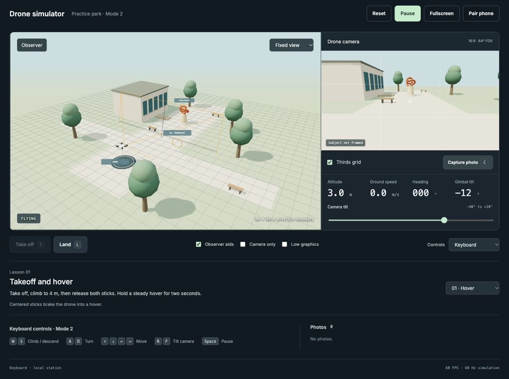

# Drone simulator

Practice camera-drone flight and photo composition on your laptop. Fly with the keyboard or use an Android phone as a two-stick Mode 2 controller, connected by USB or local Wi-Fi.

The observer view shows where the drone is going. The drone camera shows the resulting composition. Use both to learn how heading, movement, and camera tilt affect a shot, then switch to **Camera only** to practice framing without the observer view.



## What you can practice

- **Flight controls:** take off, hover, turn, move sideways, return to the pad, and land. Centered sticks brake the drone into a hover.
- **Orientation:** compare movement from a fixed observer view with movement relative to the drone's heading.
- **Photography:** tilt the stabilized camera, use the thirds grid, frame the orange sculpture, and download camera photos as PNGs.
- **Coordinated movement:** use both phone sticks together for slow reveals and changes of viewpoint.
- **Independent practice:** choose from six lesson prompts, reset a flight, and use fullscreen for more space.

This is a working prototype with one practice park and a generic assisted-flight profile. It runs locally, requires no account, and works without internet after dependencies and the app are installed and built. The phone controller opens in the browser; there is no phone app to install.

[Get started](#get-started) · [Pair a phone](#pair-an-android-phone) · [Controls](#controls) · [Lessons](#lessons) · [Troubleshooting](#troubleshooting) · [Development](#development)

## Get started

### What you need

- A Mac with Node.js **22.12 or newer** and npm.
- A laptop browser with WebGL support. Google Chrome is used by the automated browser tests.
- Optionally, an Android phone with a browser. USB control also needs a data-capable cable, USB debugging, and Android SDK Platform-Tools on the Mac.

The current setup has been exercised on Mac and Android. Other desktop and phone combinations have not been verified.

### Start the simulator

In this project directory, run:

```sh
npm ci
npm run build
npm start
```

Open [http://127.0.0.1:8080](http://127.0.0.1:8080) on the laptop. Leave the terminal running while you practice; press **Ctrl+C** there when you are finished. Future sessions only need `npm start`, unless the app has changed and needs rebuilding.

If port 8080 is already in use, choose another port:

```sh
PORT=8082 npm start
```

Then open [http://127.0.0.1:8082](http://127.0.0.1:8082). Use that same port for phone connection checks and manual USB commands below. **Connect USB phone** automatically uses the running server's port.

### Your first flight with the keyboard

1. Leave **Controls** set to **Keyboard** and select **Start practice**.
2. Select **Take off**, or press **T**. The drone climbs automatically to 3 m.
3. Hold **W** briefly to climb toward 4 m, then release it. Watch the drone brake into a hover.
4. Use the **arrow keys** to move and **A / D** to turn. Compare the observer and camera views.
5. Use **R / F** or the **Camera tilt** slider to frame the orange sculpture. Select **Capture photo**, then select its thumbnail under **Photos** to download it.
6. Return over the home pad and press **L** to land. **Land descends at the current location**; it does not return to the pad automatically.

Press **Space** to pause or resume. After a collision, select **Reset**, then **Start practice** to try again.

## Pair an Android phone

The laptop renders the simulator; the phone sends controls and displays flight status. Keep both browser pages open. Only one phone can control a laptop session at a time.

### USB: use the cable instead of Wi-Fi

USB pairing bypasses the Wi-Fi network. The local server still runs on the Mac, and ADB forwards the phone's browser connection through the cable. On the phone, `127.0.0.1` reaches the Mac only after USB forwarding is set up.

1. Install [Android SDK Platform-Tools](https://developer.android.com/tools/releases/platform-tools) on the Mac, or use the copy installed by Android Studio.
2. Enable **Developer options → USB debugging** on the phone. See [Android's USB connection instructions](https://developer.android.com/tools/adb#Enabling) if you need help finding the setting.
3. Connect the phone with a data-capable USB cable. Unlock it and accept **Allow USB debugging?** if prompted.
4. On the laptop, select **Pair phone**, choose **USB cable · no Wi-Fi**, and select **Connect USB phone**.
5. Wait for **USB connection ready**. Scan the QR code with the phone's camera or open the complete **Open on phone** URL in its browser, including the part after `#`.
6. Rotate the phone to landscape. Leave both sticks centered and select **Enable controls**.
7. Close the laptop pairing dialog and select **Start practice**. Pairing automatically selects **Phone · Mode 2** as the control source.
8. Select **Take off** on either device to begin flying.

The app finds ADB through `PATH`, the usual macOS Android SDK location, `ANDROID_HOME`, `ANDROID_SDK_ROOT`, or `ADB_PATH`. If it cannot find a separately downloaded copy, start the server with its absolute path, for example:

```sh
ADB_PATH="$HOME/Downloads/platform-tools/adb" npm start
```

Run **Connect USB phone** again after reconnecting the cable or restarting ADB if the phone can no longer reach the simulator.

<details>
<summary>Manual USB setup and removal</summary>

If `adb` is available in your terminal, you can set up forwarding yourself:

```sh
adb devices
adb -d reverse tcp:8080 tcp:8080
adb -d reverse --list
```

For a server running on port 8082, replace both occurrences of `8080` with `8082`. The forwarding list should contain the matching pair, such as `tcp:8082 tcp:8082`. `-d` selects a USB device; leave only the intended USB phone connected.

Remove this forwarding when finished:

```sh
adb -d reverse --remove tcp:8080
```

If the terminal reports `adb: command not found`, use the executable's full path or the app's **Connect USB phone** button.

</details>

### Local Wi-Fi

1. Connect the laptop and phone to the same local network.
2. Stop the existing server with **Ctrl+C**, then start it with network access enabled:

   ```sh
   npm run start:lan
   ```

   To use port 8082 instead: `PORT=8082 npm run start:lan`.

3. Open the simulator on the laptop, select **Pair phone**, and choose a **Wi-Fi** address from the **Connection** menu. If several addresses appear, choose the interface connected to the phone's network.
4. Scan the QR code or open the displayed URL on the phone. Rotate to landscape and select **Enable controls**.
5. Close the pairing dialog and select **Start practice** on the laptop.

Allow the local Node server through the Mac firewall if prompted. Guest or classroom networks can block connections between devices; use USB if the phone cannot reach the laptop.

### Pausing, resuming, and changing phones

**Pause controls** on the phone disables its input and pauses the flight. To continue, center the sticks, select **Enable controls** on the phone, then **Start practice** on the laptop. Use this same sequence after a cable disconnect, connection loss, or either page being hidden.

Keep the phone awake. The controller requests a screen wake lock where supported; if it says **Set screen timeout manually**, adjust the phone's timeout. Plain HTTP over Wi-Fi cannot use this feature. **Fullscreen** on the phone hides browser controls where supported, and **Stick size** adjusts the touch areas.

To replace the controlling phone, open **Pair phone** and select **Revoke phone & renew link**, then pair with the new QR code. A second phone cannot take over an occupied session. Links expire after 12 hours; after restarting the server or reloading the laptop page, use the current pairing link.

To return to keyboard practice, choose **Keyboard** in the laptop's **Controls** menu and select **Start practice**.

## Controls

Mode 2 puts altitude and heading on the left stick, with forward and sideways movement on the right stick.

| Action | Phone | Keyboard |
| --- | --- | --- |
| Climb / descend | Left stick up / down | W / S |
| Turn left / right | Left stick left / right | A / D |
| Move forward / backward | Right stick up / down | ↑ / ↓ |
| Move sideways left / right | Right stick left / right | ← / → |
| Tilt camera up / down | Hold the Tilt buttons | R / F, or Camera tilt slider |
| Take off / land | Take off / Land buttons | T / L |
| Take a photo | Camera shutter button | C |
| Pause | Pause controls | Space |

Movement follows the drone's heading. When the drone faces you, its rightward movement appears leftward in the fixed observer view. Releasing the sticks or movement keys commands a stop, with a short braking response into hover.

The drone body banks during movement while the camera horizon stays level. Turning the drone changes camera heading; gimbal tilt changes its vertical angle independently. Takeoff and landing are automatic maneuvers; movement input resumes after takeoff finishes.

Keyboard flight requires focus on the simulator, away from menus and sliders. The laptop's camera-tilt slider is disabled while **Phone · Mode 2** is selected.

### Views and flight information

| Setting | Use it to |
| --- | --- |
| Fixed view | Compare the drone's heading and movement from one viewpoint. |
| Follow drone | Keep the observer camera near the drone as it moves. |
| Observer aids | Show the ground grid, labels, flight trail, camera direction, and field-of-view outline. |
| Thirds grid | Place subjects using a rule-of-thirds guide in the camera view. |
| Camera only | Hide the observer view and practice from the drone camera. |
| Fullscreen | Expand the flight views and controls; lessons and photos return when you exit. |
| Low graphics | Disable shadows and reduce rendering resolution on slower hardware. |

Select **Exit fullscreen** or press **Escape** to return to the normal layout. If native fullscreen is unavailable, the simulator expands within the browser panel instead.

**Altitude** is height above the drone's ground resting position, **Ground speed** is horizontal speed, **Heading** is the drone's direction in degrees, and **Gimbal tilt** is the camera's vertical angle, from −90° to +20°.

## Lessons

Choose a lesson from the menu beside the prompt. Lessons change the exercise instructions without resetting the flight, so you can move between them during a session.

| Lesson | Exercise |
| --- | --- |
| 01 · Hover | Take off, climb to 4 m, release both sticks, and hold a steady hover for two seconds. |
| 02 · Translate | Fly through the amber marker while maintaining the starting heading. |
| 03 · Orientation | Turn to 180° and compare stick direction with motion in the fixed observer view. |
| 04 · Composition | Frame the orange sculpture using heading and gimbal tilt, then capture a photo. |
| 05 · Reveal | Move slowly sideways while turning to keep the sculpture in view. |
| 06 · Land | After taking a photo, return over the home pad and land. |

The prompts include basic completion feedback. The reveal lesson is open practice. **Subject in frame** indicates that the sculpture is visible within the camera's framing area; an obstruction can prevent this status. It is a framing aid rather than a photo-quality score.

## Photos

Select **Capture photo**, press **C**, or use the phone shutter while practice is running. Each capture appears under **Photos** on the laptop. Select a thumbnail to download its **1280 × 720 PNG**.

Photos contain only the drone camera image. The drone model, observer aids, thirds grid, crosshair, and interface labels are excluded.

The gallery keeps the six most recent captures in memory. **Download any photos you want to keep before reloading or closing the laptop tab.** Resetting the flight preserves the current gallery; photos are not automatically written to disk or uploaded.

## Troubleshooting

| Problem | What to check |
| --- | --- |
| Connection refused on the laptop | Confirm `npm start` is still running. Use the port selected at startup and run `npm run build` if the server says the app is missing. |
| Connection refused on the phone over USB | Select **Connect USB phone** again. Then open `http://127.0.0.1:8080/api/health` on the phone, substituting your port. `{"ok":true}` confirms the USB path reaches the server; return to the full pairing URL to control the simulator. Use `http`, not `https`. |
| No USB debugging prompt | Check `adb devices`. A device listed as `device` is already authorized and needs no new prompt. If it says `unauthorized`, unlock the phone, reconnect the cable, and check USB debugging. |
| ADB is missing or no phone is found | Install Platform-Tools or set `ADB_PATH`. Check USB debugging and try a data-capable cable. If several USB devices are attached, leave only the intended phone connected. |
| No Wi-Fi option, or Wi-Fi will not connect | Start with `npm run start:lan`, reload the laptop page, and pair using its Wi-Fi URL. Check the chosen network address and firewall. Networks with client isolation may require USB instead. |
| Paired, but the sticks do nothing | Select **Enable controls** on the phone, then **Start practice** on the laptop. Confirm **Controls** is set to **Phone · Mode 2** and that takeoff has finished. |
| Keyboard keys do nothing | Select **Keyboard**, start practice, and return focus from a menu or slider to the simulator. |
| Flight pauses after switching tabs or disconnecting | Return to both pages. For phone control, select **Enable controls**, then **Start practice** on the laptop. For keyboard control, select **Start practice**. |
| Collision prevents resuming | Select **Reset**. For phone control, enable its controls again before selecting **Start practice**. |
| Pairing link is rejected or another phone is connected | Select **Revoke phone & renew link** and pair using the new code. |
| Rendering is slow | Enable **Low graphics** and close other demanding applications. If the browser reports a lost graphics context, reload and pair again. |

## Current scope

The flight model approximates an assisted camera drone using bounded speed, acceleration, braking, yaw, and gimbal tilt. It does not model motors or aerodynamics. Touch sticks differ from a physical controller, and the profile is not tied to a specific drone model.

Wind, battery behavior, obstacle avoidance, gamepad input, exposure controls, video recording, additional scenes, and a persistent gallery are not implemented. Colliding with a building, tree, sculpture, ground, or practice boundary stops the exercise and requires a reset.

## Development

For local development:

```sh
npm run dev
```

Use `npm run dev:lan` for Wi-Fi development or prefix either command with `PORT=8082` to change the port. The Node server serves the app and WebSocket connection together. Reload after editing; hot module replacement is disabled so code changes do not silently retain flight input.

### Checks

```sh
npm run check
npm test
npm run build
npm run test:browser
```

Unit and WebSocket integration tests cover flight behavior, collisions, stale input, controller ownership, reconnection, revocation, action deduplication, and USB forwarding. Browser tests use installed Google Chrome by default and start a production server on port **8081**; build first and keep that port free. They cover keyboard flight, both views, PNG export, simultaneous touch input, release/cancellation, and disconnect/background pauses.

To use Playwright's Chromium instead:

```sh
npx playwright install chromium
BROWSER_CHANNEL=chromium npm run test:browser
```

Screenshots and failure traces are written to `test-results/`. Browser emulation complements physical-device testing; sustained touch behavior, USB/Wi-Fi reliability, and performance still need checks on the intended training hardware. Displayed RTT and receipt-to-frame timing are diagnostics, not measured touch-to-visible latency.

### How it works

- The laptop browser owns flight and lesson state and runs the simulation at a fixed 60 Hz step. The phone sends complete control inputs at approximately 60 Hz plus immediate changes.
- The Node server serves bundled assets, authenticates the laptop and phone session roles, and relays controls. Phone messages do not supply drone positions.
- Phone input expires after 250 ms in both the server and laptop. Page hiding, connection loss, send-queue overflow, and display stalls pause the exercise; resuming requires fresh input. Connection generations and sequence numbers reject old or repeated inputs.
- Takeoff, landing, and capture use action IDs and acknowledgments so retries cannot execute the same action twice within a connection generation.

The generic flight settings are in [src/simulation.ts](src/simulation.ts). The scene and camera rendering are in [src/world.ts](src/world.ts), and the phone controller is in [src/controller.ts](src/controller.ts).
